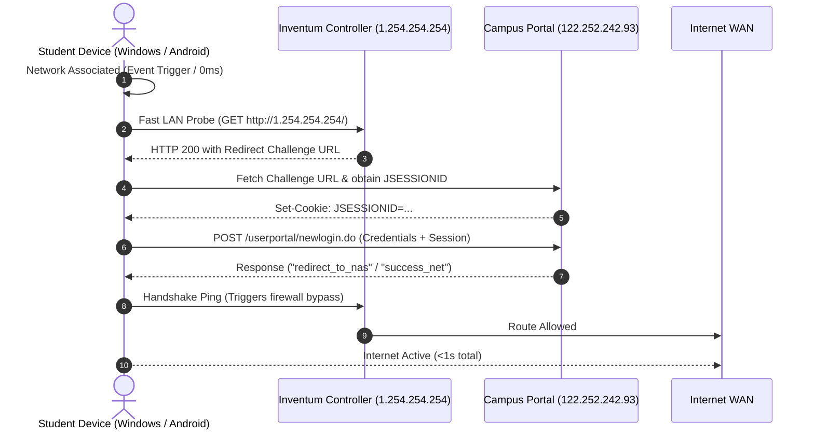

# Campus Connect

[](https://play.google.com/store/apps/details?id=com.niitnydv.campusconnect)
[](https://github.com/nitinya9av/campus-connect/releases/latest)
[](https://nitinyadav.xyz/campus-connect/)
[](LICENSE)
[](https://nitinyadav.xyz/campus-connect/privacy)

Instant, automated Wi-Fi auto-login utility and background watchdog for the **Central University of Rajasthan (CURAJ)** captive portal gateway.

Campus Connect eliminates the daily hassle of repeatedly typing mobile credentials, expired session prompts, and login timeouts across campus hostels, departments, and libraries.

---

## Downloads & Platforms

| Platform | Format | Distribution | Description |
| :--- | :--- | :--- | :--- |
| **Android** | `.apk` / `.aab` | **[Google Play Store](https://play.google.com/store/apps/details?id=com.niitnydv.campusconnect)** | Official Android release. Silent 24/7 background reconnection service with zero sensitive permissions. |
| **Windows** | `.msix` | **[GitHub Releases](https://github.com/nitinya9av/campus-connect/releases/latest)** | Modern packaged Windows application. Native 1-click install, start menu integration, and clean sandbox. |
| **Windows** | `.exe` | **[GitHub Releases](https://github.com/nitinya9av/campus-connect/releases/latest)** | Portable standalone client (~26 KB). Zero installation, zero admin rights, runs in user-space. |
| **macOS** | `Script / launchd` | **[1-Line Terminal Command](mac/)** | Native user-space background service via Apple's built-in `launchd`. Zero GUI overhead. |
| **Web Portal** | Static Site | **[nitinyadav.xyz/campus-connect](https://nitinyadav.xyz/campus-connect/)** | Minimalist editorial portal with setup instructions, status diagnostics, and privacy documentation. |

---

## Key Features

- **⚡ Sub-Second Instant Authentication (<1s)**: Connects to campus Wi-Fi instantly across all platforms. Eliminates artificial delay loops and sequential timeout traps.
- **🛡️ Zero Sensitive Permissions**: The Android app requests **no location, no camera, no microphone, no storage, and no contacts access**. 100% auditable client-side logic.
- **🔄 Event-Driven Background Reconnection**:
  - **Windows**: Hooks directly into native OS network events (`NetworkChange.NetworkAddressChanged`) for 0ms wakeup the exact moment Wi-Fi associates.
  - **macOS**: Native user-space `launchd` LaunchAgent triggered instantly on network state changes.
  - **Android**: Lightweight native foreground service running with `IMPORTANCE_MIN` for seamless 24/7 background session maintenance without battery drain.
- **🔐 Local-Only Security**: All credentials are encrypted and stored strictly on your local device (`EncryptedSharedPreferences` on Android, `%APPDATA%\CURAJ_Connect\config.json` on Windows, `~/.curaj-connect/config.json` on macOS). Zero external telemetry, tracking, or remote analytics.
- **🧹 1-Click Clean Deregistration**: Tap or run **Deregister / Uninstall** anytime to stop all services and permanently erase stored credentials from your device.

---

## Technical Architecture

Campus Connect interacts directly with the campus Inventum AAA gateway controller:



1. **Hardware-Triggered Wakeup**: When Wi-Fi associates or DHCP assigns an IP address, OS network events wake the client immediately with zero polling delay.
2. **Local Controller Handshake**: Pings the local Inventum NAS controller (`1.254.254.254`) on the local subnet to grab the session challenge.
3. **Direct Gateway POST**: Dispatches an authenticated POST to `/userportal/newlogin.do` matching the official campus gateway protocol.
4. **Bypass Trigger**: Completes the controller handshake upon `redirect_to_nas` to open outward WAN internet traffic.

---

## Repository Structure

```
curaj-wifi/
├── index.html                        <- Web portal landing page (hosted on GitHub Pages)
├── style.css                         <- Minimalist warm editorial styling (Light & Dark theme)
├── app.js                            <- Theme toggle & client-side scripts
├── privacy/
│   └── index.html                    <- Hosted Google Play-compliant privacy policy (/privacy)
├── windows/
│   ├── campus-connect.cs             <- Native C# client with event-driven background watcher
│   ├── build-msix.ps1                <- Automated packaging & signing script for .msix
│   ├── app.manifest                  <- Per-Monitor V2 High-DPI Windows application manifest
│   └── README.md                     <- Windows developer & compilation instructions
├── mac/
│   ├── campus-connect.sh             <- Native macOS shell client & launchd daemon
│   ├── install.sh                    <- 1-line Terminal installer script
│   └── README.md                     <- macOS documentation & manual commands
├── mobile/                           <- React Native & Native Android codebase
│   ├── App.js                        <- Cross-platform mobile UI & registration screen
│   ├── src/                          <- Shared API, storage, and theme utilities
│   │   ├── api/gateway.js            <- Fast-path gateway authentication logic
│   │   └── storage/credentials.js    <- Local secure credential management
│   └── android/                      <- Native Android implementation
│       ├── app/src/main/java/com/niitnydv/campusconnect/
│       │   ├── CampusConnectCore.kt  <- Native fast-path network login engine
│       │   ├── CampusConnectService.kt <- 24/7 background listener service
│       │   ├── CampusConnectReceiver.kt<- Network change broadcast receiver
│       │   └── CampusConnectModule.kt<- React Native native bridge
│       └── app/campusconnect-release.keystore <- Production release keystore
├── .github/
│   └── workflows/
│       └── build-and-sign.yml        <- CI/CD: compiles, packages MSIX, signs, and releases
├── .gitignore                        <- Excludes build artifacts, binaries, and keys
└── README.md                         <- Root documentation
```

---

## macOS 1-Line Terminal Install

On any MacBook or iMac, open **Terminal** (`Cmd + Space` &rarr; `Terminal`) and paste:

```bash
curl -sSL https://raw.githubusercontent.com/nitinya9av/campus-connect/master/mac/install.sh | bash
```

- Wakes up in **0ms** using macOS native `launchd` service when Wi-Fi connects.
- To uninstall anytime: `~/.curaj-connect/campus-connect.sh --uninstall`

---

## Windows App Usage & Compilation

### Running from Pre-Built Release
Download from [GitHub Releases](https://github.com/nitinya9av/campus-connect/releases/latest):
- **MSIX Package (`campus-connect.msix`)**: Double-click to install natively via Windows App Installer.
- **Portable Binary (`campus-connect.exe`)**: Double-click to open the standalone GUI.

### Command-Line Interface (CLI)
```powershell
# Register auto-login and launch background watcher
campus-connect.exe --register <mobile_number> <password>

# Unregister, delete saved credentials, and terminate background watcher
campus-connect.exe --unregister

# Test immediate one-shot login
campus-connect.exe --login

# Run background watchdog listener
campus-connect.exe --watch
```

### Compiling from Source
Windows includes the Microsoft C# compiler (`csc.exe`) by default. No heavy IDE or Visual Studio installation is required:

```powershell
& "C:\Windows\Microsoft.NET\Framework64\v4.0.30319\csc.exe" /target:winexe /win32manifest:windows\app.manifest /out:windows\campus-connect.exe windows\campus-connect.cs
```

To package the MSIX container locally:
```powershell
powershell -ExecutionPolicy Bypass -File windows/build-msix.ps1
```

---

## Android App Development

The mobile app is built with **React Native** and a lightweight **Native Kotlin Service** for 24/7 background re-authentication.

### Building Locally
```bash
cd mobile

# Install dependencies
npm install

# Run Android debug build on connected device
npx react-native run-android

# Build production release APK
cd android
./gradlew assembleRelease

# Build production release App Bundle (.aab) for Google Play
./gradlew bundleRelease
```

---

## Security & Privacy Commitment

- **100% Client-Side**: No user data, passwords, device fingerprints, or logs are ever transmitted to any third-party server.
- **Direct LAN Communication**: Authentication requests travel strictly between the user device and the official CURAJ campus gateway (`122.252.242.93` / `1.254.254.254`).
- **No Third-Party SDKs**: Zero Google Analytics, Firebase, Facebook SDK, or ad networks.
- **Official Privacy Policy**: Available at [nitinyadav.xyz/campus-connect/privacy](https://nitinyadav.xyz/campus-connect/privacy).

---

## Acknowledgements

- **SignPath Foundation**: Free open-source code signing certificate provided by the [SignPath Foundation](https://signpath.org).
- **Central University of Rajasthan (CURAJ)**: For providing campus internet infrastructure.

---

## License

This project is open source and available under the [MIT License](LICENSE).
